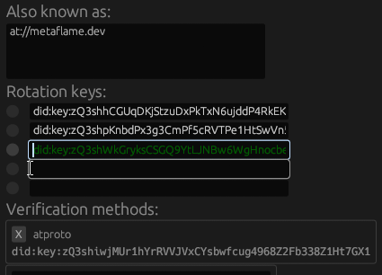
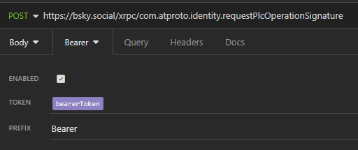
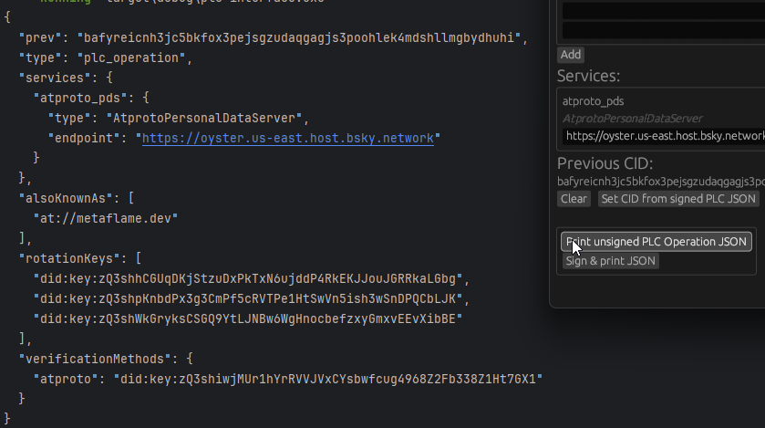

[⬅️ _Back to the main README_](../README.md)

# Adding your first rotation key

Let's say I want to get my own signing key into the rotation key array. This first step is a bit more involved, because
I _don't yet have_ a signing key in the rotation, so I can't sign the operation myself. No problem, I'll just have to
ask my current PDS first!

In short, I'll need to:

- Prepare my updated (unsigned) PLC operation
- Request a token for a PLC operation signature from my PDS
- Ask my PDS to actually sign the operation
- Publish the PLC operation (via my PDS or to plc.directory directly)

I can't make full use of my GUI tool here, but let's at least get familiar with it.

### _Figuring out your identity_

Throughout this whole process, I'll need to use my did:plc identifier multiple times,
so it's a good idea to do that now.
There are multiple ways to resolve an `at://` handle, the PDS endpoint is a pretty straightforward way to go about it.

I'll also have to contact my PDS a few times, so let's establish that too. My current PDS is at `bsky.social`
(that's technically my PDS' _entryway_, but both the entryway and direct PDS url will work here).
As such, **`bsky.social` will be my base domain** for PDS requests, so all those HTTP requests will **start with
`https://bsky.social/xrpc/`**.
_Unless you're self-hosting, your PDS will probably have the same entryway domain too._

To get my did:plc, I'll send **a GET request to
`https://bsky.social/xrpc/com.atproto.identity.resolveHandle?handle=metaflame.dev`**.

Should you find yourself looking for someone's did:plc without immediate access to a convenient HTTP client,
I can suggest a site such as [internect.info](https://internect.info) (I love the word
[_internection_](https://www.pfrazee.com/blog/why-not-p2p#not-quite-p2p-not-quite-federation) ♥).

_If you want to learn more about handle resolution,
[check out the ATProto docs](https://atproto.com/specs/handle#handle-resolution)._

## Getting the PLC operation ready

I can get my unsigned PLC operation ready before I'll need to ask my PDS to sign it - so let's do that first. All PLC
operations (currently) reside in [plc.directory](https://plc.directory), and are publicly accessible to everyone - you
just need the did:plc identifier.

### _Fetching the logs..._

With my handle resolved to my PLC identifier, I'll **send a GET
request to `https://plc.directory/did:plc:c6te24qg5hx54qgegqylpqkx/log/last`** (substitute with your own identifier, of
course).

_Now, when signing via your PDS, you can technically just edit the JSON object directly without using the GUI. However,
in this case, you'll still need to generate a signing key to add to your rotation keys - so this is a good chance to get
familiar with my GUI tool._

### _...and leaving our own mark_

So, PLC directory responds with a JSON object, which I'll copy into my clipboard. I'll start up the `plc-interface`
binary and **click _"Load signed operation from clipboard (JSON) & set CID ref"_**. If all goes well, the interface will
fill out all the fields from my copied PLC operation. I'll **open the _Keys_ dropdown** in the Key Store at the top _(
and make sure that my key store path is set correctly)_, where I can **generate a new signing key** using _Add Key_ (or
use one of my existing keys - though reusing signing keys across multiple PLC identities is discouraged!) **I'll copy my
did:key of choice into one of my Rotation key slots** - I'll put it below the two existing (default) ones for now (but
keep in mind that you MUST keep your PDS' rotation key in the list too!). The key is colored green, meaning I have its
signing key in my key store.



## Asking the PDS for a signature

Now, I can't sign the operation, because my rotation key has not been published yet - that would be like sticking a
post-it note on someone's car and claiming that it's yours "because it has your name on it". The first operation must be
signed by my PDS.

### _Where we're going, we do need passwords_

This is where I'll start having to use _authenticated_ requests, so I'll first need to create a session.
To get my access JWT (my session token), I'll **send an _unauthenticated_ `POST` request to
`https://bsky.social/xrpc/com.atproto.server.createSession`** with credentials in the body:

```json
{
  "identifier": "metaflame.dev",
  "password": "hunter2"
}
```

Asking your PDS to sign a PLC operation for you is a high-privilege action. For that reason, you **MUST USE YOUR MAIN
PASSWORD**, app passwords won't work here! In addition, I recommend using this access JWT _only_ for
the following three HTTP requests, same as how you wouldn't run every bash command
with `sudo`.
_Note that this is subject to change as we get more granular OAuth scopes, and if app passwords change or get deprecated._

From here on, all requests are _authenticated_ with a Bearer token (prefix: `Bearer`, token: value of `accessJwt`).



### _The op's so nice you must ask twice_

Next, I need to ask for _permission_ to sign a PLC op by **sending a POST request
to `https://bsky.social/xrpc/com.atproto.identity.requestPlcOperationSignature`** (with no body). Again, this is an
action that affects the very did:plc your account is bound to, super sensitive stuff! Assuming I got a response of 200,
the PDS will email me a one-time token for the next step.

### _An autograph, please_

Finally, I can get my PLC operation signed. Since I can't self-sign yet, I'll
**click _"Print unsigned PLC Operation JSON"_** at the bottom of the GUI. Then, I'll **send a POST request
to `https://bsky.social/xrpc/com.atproto.identity.signPlcOperation`**, pasting my unsigned PLC op object into the body,
and **making sure to add a `token` field** with the one-time token I had received earlier.

_Note that you technically don't need the `prev` field for this endpoint, but there's no need to remove it either._



If you got a happy 200 response, congrats! You're just one step away from officially adding your own signing key.

### _The point of no return_

...okay, that's a bit too dramatic, there _are_ (implementation-specific) recovery methods. Still, pushing out a PLC
operation shouldn't be taken lightly. Luckily, we can ask our PDS to double-check our work first!

There are two ways to go about publishing your PLC operation. You can POST it to plc.directory directly, or - as
mentioned - you can ask your PDS to submit the PLC operation for you. The former needs no PDS authentication and has no
additional restrictions - check out [Self-signing](./self_signing.md) for that process. **I'll go through the PDS** in
this case, though.

This is the final step that needs the access JWT generated using my main password, but the process couldn't be simpler:
**send a POST request to `https://bsky.social/xrpc/com.atproto.identity.submitPlcOperation`** and attach the
response from the previous signing step as the body (so, a JSON object with one field, `"operation"`, which is the
PLC operation object you're trying to publish).

Asking the PDS to publish the PLC op for you is safer, because it involves extra validation. The PDS makes sure that:

- the operation isn't malformed
- the PDS' rotation key is still present
- the service endpoint is its own
- the validation key matches the one stored in your account
- the first `alsoKnownAs` entry is the same as your current handle (that is, `at://{handle}`)

Once you start self-signing to move to another PDS, remove other keys, or do other shenanigans, you'll have to POST to
plc.directory directly. It's less restrictive, but you'll be on your own. The PDS route imposes extra validation rules
as sanity checks, which makes sure that you don't accidentally mess something up.

---

**But there you have it!** I'll send one last GET request to `https://plc.directory/did:plc:c6te24qg5hx54qgegqylpqkx`
(again, you should substitute my did:plc with your own), and if I did everything right, I should see a third rotation
key in the response. My own rotation key, even!

Speaking of which, **keep that signing key safe**. If you lose it, you're at the mercy of the owners of the other
signing keys (that would still be your PDS, in this case). If you leak it, you're at the mercy of time and luck,
depending on how the index of the leaked key. You can read more details about rotation key authority & account
recovery [here](https://github.com/did-method-plc/did-method-plc?tab=readme-ov-file#key-rotation--account-recovery).

_[Your complementary Bluesky Badge of Honor should arrive shortly](https://bsky.app/profile/decentralise.goeo.lol)_

And if you want to go further, **why not check out [how to sign a PLC operation on your own?](./self_signing.md)**
_(WIP)_
Self-signing was the main reason I started working on this project, after all.