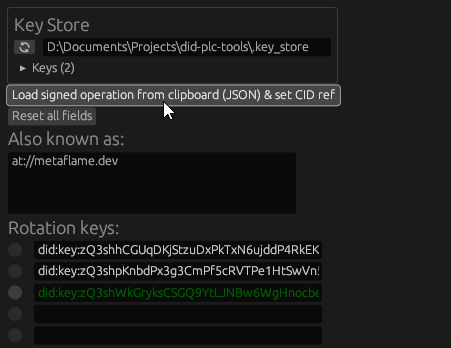
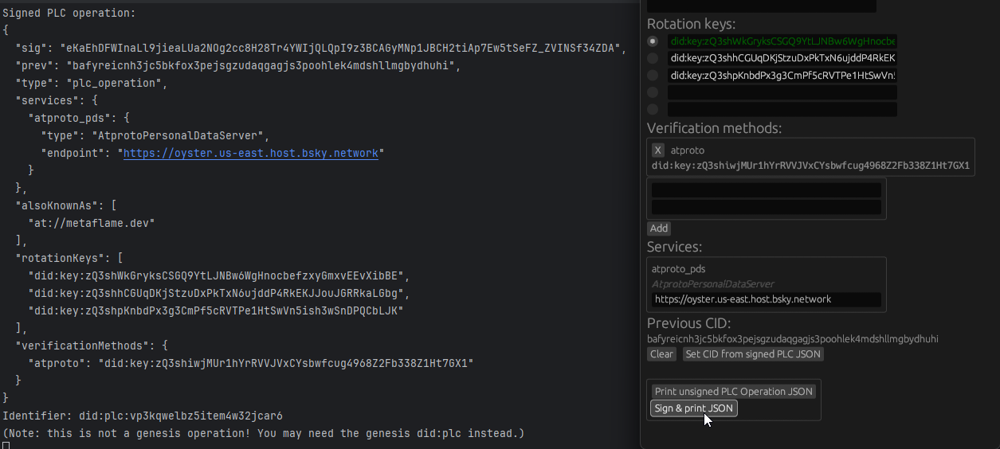

[⬅️ _Back to the main README_](../README.md)

# Signing your first PLC operation

Once you've [added your own rotation key](./add_rot_key.md) to your DID PLC, you're ready to use this GUI tool the way
the machine gods intended. That is... you can finally use the main feature, the reason I developed this library and
interface in the first place - to take an existing PLC operation, modify it, and sign it without having to ask your PDS
for permission.

No more login sessions needed! No more HTTP calls to your PDS! The power rests in your signing key, and that signing key
rests in your hands now... you _did_ store it safely, right?

So, let's say I had already pushed out my first PLC operation, where I added my own rotation key. I want to go back now
and move my rotation key to the top of the list, giving it the highest authority.

This matters because of PLC's
[recovery mechanism](https://github.com/did-method-plc/did-method-plc?tab=readme-ov-file#key-rotation--account-recovery),
where a higher-authority key can fork any operation signed by a lower-authority key up to 72 hours into the past,
overriding and invalidating the old chain of operations and "rewriting history".
For example, if a lower-authority key maliciously removed your own signing key, which was at index 0, you have
72 hours to override the malicious operation by forking the chain at the last point where your own signing key had
higher authority (= lower index), taking your DID PLC back and invalidating all operations in
the other part of the fork.

## Getting the latest PLC operation

### _Your ID, please_

There's actually one last HTTP request we need to send out to your PDS, assuming you didn't write down your did:plc
identifier. [As mentioned before](./add_rot_key.md#_figuring-out-your-identity_), there are multiple ways to resolve
your handle. You can go to the domain itself and fetch the `_atproto` DNS TXT record or the `/.well-known/atproto-did`
resource, you can use a 3rd-party tool such as [internect.info](https://internect.info), but I'll stick to the PDS xrpc
endpoint, `com.atproto.identity.resolveHandle`.

Once again, my PDS (entryway) is at `bsky.social`, so getting my did:plc is as simple as **sending a GET request
to `https://bsky.social/xrpc/com.atproto.identity.resolveHandle?handle=metaflame.dev`**. Substitute the last part with
your own handle, of course.

Identifier in paw (hand, talon, or another appendage or end effector specific to you),
I can move on to finally fetching my latest PLC operation.

### _Taking what is (now) yours_

From now on, we'll only need to send unauthenticated requests to [plc.directory](https://plc.directory).
After all, we're dealing with a public ledger, and we prove that we're authorized to modify a PLC operation chain
with our signing key.

I only need the most recent PLC operation, so I'll
**GET `https://plc.directory/did:plc:c6te24qg5hx54qgegqylpqkx/log/last`**. I'll grab the response body, copy it
to my clipboard, and start up `plc-interface`.

## Making changes

### _A sign of something great_

We're finally getting to the main point, the reason I started this project in the first place - **_self-signing_**.
With the JSON object in my clipboard, I'll **click the aptly-named
_"Load signed operation from clipboard (JSON) & set CID ref"_**, which should fill out all fields
in the GUI appropriately.

And there it is, my own rotation key coming directly from plc.directory! Because the app loaded it into its key store,
it knows that I own the signing key, and highlights that fact by making the text green. If yours didn't turn green,
make sure your key store directory is set to the same location as last time
(otherwise, you'll have to [add your own rotation key first](./add_rot_key.md)).

At this point, I'm free to edit the PLC operation as I please. The other main thing you'd use this tool for is to
redirect your `AtprotoPersonalDataServer` service endpoint to your self-hosted PDS - but for now, I'll just move my
signing key to the top of the list.
_(Yes, that involves slightly messy copy-pasting, but look, it's a proof-of-concept tool okay?)_

Once that's all done, it's time to sign the operation. You may have noticed that the owned signing key also now
has an enabled radio button to the left of it - by clicking that, I'll select the rotation key I want to use
for signing. And, finally, I can **click _"Sign & print as JSON"_**, and assuming I did everything right, the program
should spit out the signed PLC operation into my terminal, free for the copy-pasting.

### _Disturbing the status quo_

I've got my JSON object, signature included - now I just need to let the world know about it. After pulling up
Insomnia again, I'll dial `https://plc.directory/did:plc:c6te24qg5hx54qgegqylpqkx`, and **send a POST request with
the signed JSON object as the body**. _Note that sending a GET request instead would fetch my DID PLC document
(that's a whole separate thing!)._

Sending my updated PLC operation directly to plc.directory imposes fewer validation checks than taking the PDS route -
in fact, besides obvious things like checking the signature, there are mostly just basic length limits for fields.
If all went well, I'll get a 200 OK response, and the deed is done.

Now, to verify everything one more time, I can fetch the latest PLC operation again
(GET `https://plc.directory/did:plc:c6te24qg5hx54qgegqylpqkx/log/last`), and that should return the same JSON object
as the one I sent in just now. My very own, self-signed PLC operation.

---

If you're reading this, you stuck with me through the whole process - **congrats!** Thank you for taking the time.
This was a fun project to dive into after dealing with severe burnout, and I hope to take this even further
in the following months. And, perhaps, this repository may also act as useful reference to you.
